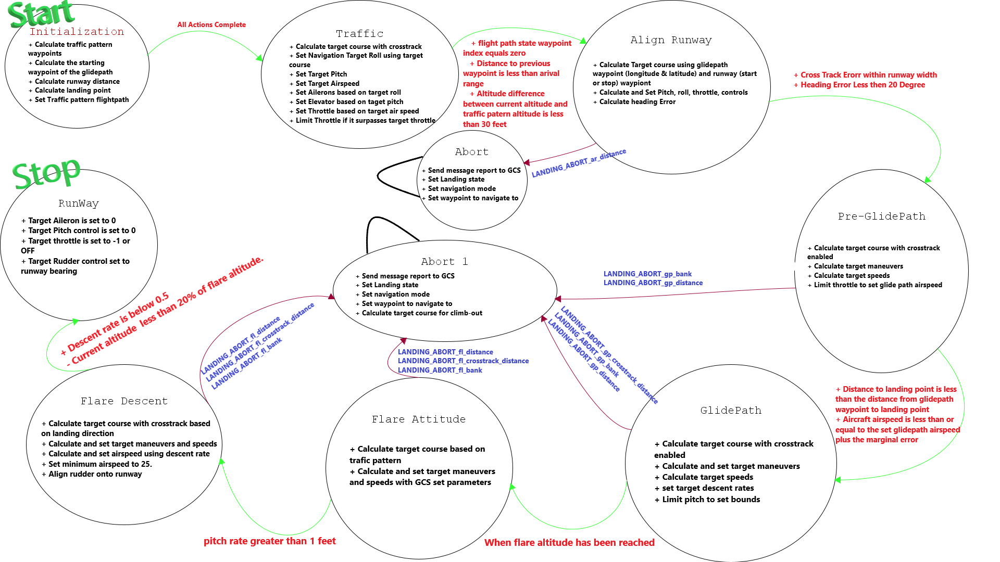

# Fixed Wing Landing


## LANDING_MODE_init

Landing mode initialization calcualtes and set pre-landing values

#### `Actions`

+ Calculate traffic pattern waypoints based on traffic pattern widt(settings) and the glidepath pitch and traffic pattern altitude
+ Calculate the starting waypoint of the glidepath
+ Calculate runway distance
+ Calculate landing point on runway 30 feet from start of runway
+ Save old flightpath state and replace with traffic pattern flightpath

 `Transistion Conditions`
 
when all *`Actions` Complete* 

 `Abort Conditions`
 None 

```text
Left traffic pattern
	3 ------------------------------------- 2
	|										|
	|										|
	|                                       |
	|										|
	|										|
	0 ------------------------------------- 1
        ->---->---->---->---->---->----

Right traffic pattern
	2 ------------------------------------- 3
	|										|
	|										|
	|                                       |
	|										|
	|										|
	1 ------------------------------------- 0
        ----<----<----<----<----<----<-
```
## LANDING_MODE_traffic

In this mode,the aircraft flies the traffic pattern using regular autonomous controls. This means that the navigation system will determine the target course.

#### `Actions`
+ Calculate target course with crosstrack enabled when enteredtrafficotherwise just use normal waypoint
+ Set Navigation Target Roll using target course
+ Set Target Pitch
+ Set Target Airspeed
+ Set Ailerons based on target roll
+ Set Elevator based on taget pitch
+ Set Throttle based on target air speed 
+ Limit Throttle if it surpasses target throttle

`Transistion Conditions` 

* When all waypoints have been set as a trarget course 
- When All following conditions are true
   + flight path state waypoint index equals zero
   + Distance to previous waypoint is less than arival range  
   + Altitude difference between current altitude and traffic patern altitude is less than 30 feet

`Abort Conditions` 
 None

## LANDING_MODE_align_runway


In this mode, the aircraft aligns to the runway using crosstrack to calculate target course. Calculation parameters are chosen based on the landing direction.

 #### `Actions`
+ Calculate Target course using glidepath waypoint (longitude & latitude) and runway (start or stop) waypiont
+ Calculate and Set Pitch, roll, throttle, controls 
+ Calculate heading Error

`Transistion Conditions` 

When All the following are true:
   + Cross Track Erorr within runway width
   + Heading Error Less then 20 Degree

`Abort Conditions` 
When the following are true:
   + Half of the glide path waypoint distance is greater than distance to end of runway
   + cross-track error is greater than 20% of runway width
   + Abort Mode is LANDING_MODE_abort


## LANDING_MODE_pre_glidepath

In this mode, pre glidepath conditions are set using regular crosstrack to determine heading, reduces throttle to reach target glidepath speed. Calculation parameters are chosen based on the landing direction.

 #### `Actions`

+ Calculate target course with crosstrack enabled
+ Calculate target maneuvers
+ Calculate target speeds
+ Limit throttle to set glide path airspeed

`Transistion Conditions` 

When the following are true:
+ Distance to landing point is less than the distance from glidepath waypoint to landing point
+ Aircraft airspeed is less than or equal to the set glidepath airspeed plus the marginal error

`Abort Conditions` 

+ When aircraft altitude is less than 20 feet 
+ When aircraft target roll is less than 20 degrees
+ When the end of the runway is less than 30% of the runway length
+ Abort Mode is LANDING_MODE_abort1

## LANDING_MODE_glidepath

In this mode, Glidepath conditions are set using regular crosstrack calculation to determine heading, throttle controls descent rate and elevator controls.

 #### `Actions`
+ Calculate target course with crosstrack enabled
+ Calculate and set target maneuvers
+ Calculate target speeds
+ set target descent rates
+ Limit pitch to set bounds 

`Transistion Conditions`

When flare altitude has been reached

`Abort Conditions` 

When the following are true:
+ Cross-track distance is to large below 50 feet
+ Target roll angle is above 20 degrees and altitude is below 20 feet
+ Aircraft is getting to close to the end of the runway
+ Abort Mode is LANDING_MODE_abort1

## LANDING_MODE_flare_attitude

 In the mode, the aircraft flare attitude controls, which is the process of controlling the orientation of an aerospace vehicle with respect to the landing setting.

 #### `Actions`

+ Calculate target course based on trafic pattern
+ Calculate and set target maneuvers and speeds with GCS set parameters

`Transistion Conditions`
+ pitch rate greater than 1 feet

`Abort Conditions` 

+ Aircraft is getting to close to the end of the runway
+ Crosstrack error gets bigger than half runway width
+ Bank angle is greater than 20 degrees
+ Abort Mode is LANDING_MODE_abort1

## LANDING_MODE_flare_descent

In this mode, flare descent conditions are set using target pitch and descent rate. It utilizes proportional control from descent rate to airspeed.

 #### `Actions`

+ Calculate target course with crosstrack based on landing direction
+ Calculate and set target maneuvers and speeds
+ Calculate and set airspeed using descent rate 
+ Set minimum airspeed to 25.
+ Align rudder onto runway 

`Transistion Conditions`

When the following are true:
+ Descent rate is below 0.5
- Current altitude minus marginal error is less than 20% of flare altitude.


 `Abort Conditions` 

+ Aircraft is getting to close to the end of the runway
+ Crosstrack error gets bigger than 30% of runway width
+ Bank angle is greater than 10 degrees
+ Abort Mode is LANDING_MODE_abort1

## LANDING_MODE_runway

In this mode, runway maneuvers are set to bring aircraft to a complete stop.

 #### `Actions`

+ Target Aileron is set to 0
+ Target Pitch control is set to 0
+ Target throttle is set to -1 or OFF
+ Target Rudder control set to runway bearing

`Transistion Conditions`
+ Airspeed is less 5 
 `Abort Conditions` 
 None

None

## LANDING_MODE_abort

In this mode, Landing is aborted and current stable flight is maintained. Previous aircraft stated is restored.

 #### `Actions`
+ Send message report to GCS
+ Set Landing state
+ Set navigation mode 
+ Set waypoint to navigate to 

 `Transistion Conditions`
 None 

 `Abort Conditions` 
 None

## LANDING_MODE_abort1
In this mode, Landing is aborted and the aircraft Transition to takeoff  and climbout state. Target course is towards the end of the runway.

 #### `Actions`
+ Send message report to GCS
+ Set Landing state
+ Set navigation mode 
+ Set waypoint to navigate to 
+ Calculate target course for climb-out

`Transistion Conditions`
None

`Abort Conditions` 
None


### Abort Modes Table


| Mode                               | Brief                                           |Value|
| ---------------------------------- |:------------------------------------------------:|---:|
|LANDING_ABORT_ar_distance         	 |cross-track not within runway width (Align runway)| 0 |
|LANDING_ABORT_gp_crosstrack_distance| cross-track not within runway width (glidepath)  | 1 |
|LANDING_ABORT_gp_bank				 | to much bank angle (glidepath)                   | 2 |
|LANDING_ABORT_gp_distance			 | to close to end of runway  (glidepath)           | 3 |
|LANDING_ABORT_fl_distance			 | to close to end of runway (flare Mode)           | 4 |
|LANDING_ABORT_fl_crosstrack_distance| cross-track not within runway (flare mode)       | 5 |
|LANDING_ABORT_fl_bank				 | to much bank angle flare (flare mode)            | 6 |


##### State Diagram

